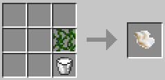
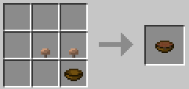
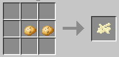
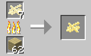
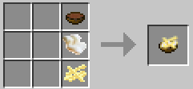

# PoutineMod #

A simple Forge-based mod to add the glories of [poutine](https://en.wikipedia.org/wiki/Poutine) to Minecraft.
The poutine is craftable, as are its ingredients.

### What's in the mod? ###

* __Cheese Curds__ - *milk + vines* (vines might be a vegetable source of [rennet](https://en.wikipedia.org/wiki/Rennet#Vegetable_rennet), right?)
* __Gravy__ - *bowl + 2 brown mushrooms* (like mushroom stew, but browner)
* __Sliced Potatos__ - *2 potatos* (makes a good amount of fries, hopefully)
* __Fries__ - *sliced potatos* cooked in an oven (until deep friers are invented)
* __Poutine__ - *Fries*, covered in *Cheese Curds*, smothered in *Gravy*. Disgustingly good.

Poutine is very filling.

### Recipes ###

### How to try the mod? ###

A pre-build jar file should be available in the download area of the [bitbucket respository](https://bitbucket.org/timtoo/minecraft-poutinemod),
ready to be dropped in your Minecraft Forge mods folder.

### How to use the source? ###

This information, with more detail, has been mooved to the USE-THE-FORCE.md file. Look there.

